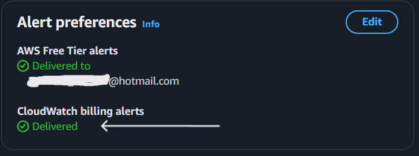
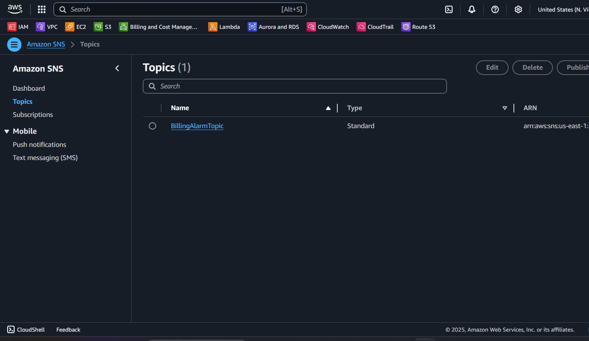
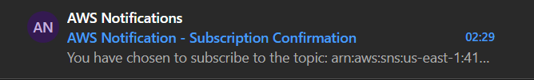

# AWS Billing Alarm

This project allows you to set up a **billing alarm** in **Amazon CloudWatch** that notifies you via email when your AWS account's estimated charges exceed **5 euros** per month. Everything is implemented programmatically using **Python** and the AWS SDK, **Boto3**.

  

## Table of Contents

- [🏠 AWS Billing Alarm](#aws-billing-alarm)
  - [Table of Contents](#table-of-contents)
    - [📋 Prerequisites](#prerequisites)
    - [🚀 Quick Setup](#quick-setup)
    - [🔔 Create the Billing Alarm](#create-the-billing-alarm)
    - [🔍 Project Details](#project-details)
    - [📝 Important Notes](#important-notes)
    - [🛠️ Troubleshooting](#troubleshooting)
    - [📄 License](#license)
    - [🌟 Acknowledgments](#acknowledgments)

## Prerequisites

Before you begin, ensure you have the following ready:

- **AWS Account** with permissions to:
  - Create alarms in CloudWatch (`cloudwatch:PutMetricAlarm`).
  - Manage SNS topics (`sns:CreateTopic`, `sns:Subscribe`).
  - Access billing data (**Best Practice**: an IAM user that has been given permission to view billing information instead root user).

- **Billing Alerts Enabled**:
  - Go to the "Billing and Cost Management" dashboard.
  - Under "Billing Preferences," enable "Recieve Billing Alerts".
  - 

- **Local Environment Setup**:
  - **AWS CLI** installed and configured:

    ```bash
    aws configure
    ```

    For more information: (<https://docs.aws.amazon.com/cli/latest/userguide/cli-chap-getting-started.html>).
  - **Python3.10** and **Boto3** installed:

    ```bash
    pip install boto3
    ```

## Quick Setup

### Create an SNS topic for Notification

Set up an Amazon SNS topic to recieve email notifications:

Click on the following link to view the sample script: [sns_notification.py](scripts/sns_notification.py).

- Confirm the subscription from the email you recieve.  
- .
- .

## Create the Billing Alarm

Run this script to create the alarm in CloudWatch:
[create_billing_alarm.py](scripts/create_billing_alarm.py)

- Replace `TUCUENTAID` for your AWS account ID.
- 
- 

## Project Details

- **Main File**: [Create Billing Alarm](/scripts/create_billing_alarm.py).
- **Alarm Threshold**: 5 euros.
- **Notification**: Email via Amazon SNS.
- **Region**: `us-east-1` (required for billing metrics).

## Important Notes

- Billing metrics are only available in `us-east-1`.
- Ensure you use your AWS account ID in the SNS topic ARN.
- The alarm evaluates daily based on estimated charges.

## Troubleshooting

- **Permission errors**: verify your AWS user has the required permissions.
- **No email recieved**: Confirm the SNS subscription and check your spam folder.
- **Alarm not showing**: Ensure billing alerts are enabled in AWS Billing and Cost Management dashboard.

## License

This project is licensed under the [MIT License](/LICENSE).

## Acknowledgments

- [Boto3 Documentation](https://boto3.amazonaws.com/v1/documentation/api/latest/index.html).
- [CloudWatch Alarms Guide](https://docs.aws.amazon.com/AmazonCloudWatch/latest/monitoring/AlarmThatSendsEmail.html).

Thanks for stopping by! If you like what I do, feel free to leave a ⭐ on my repositories. ✨
